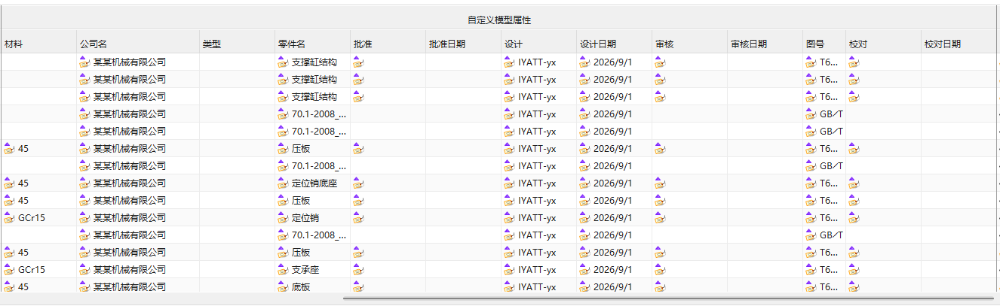
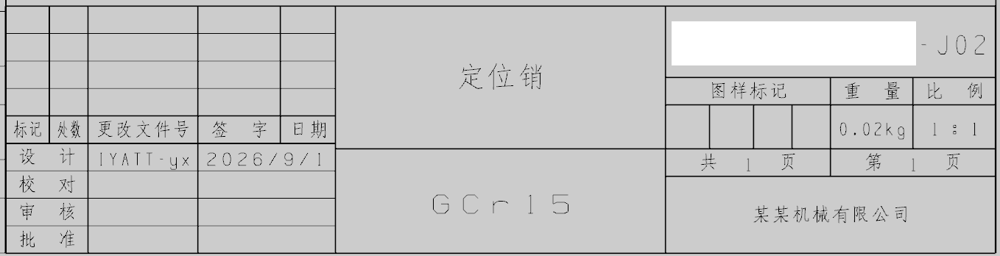
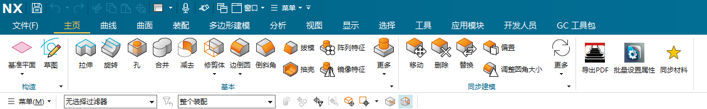
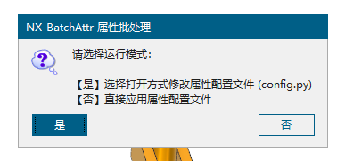
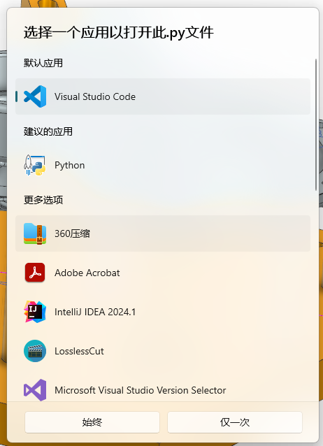
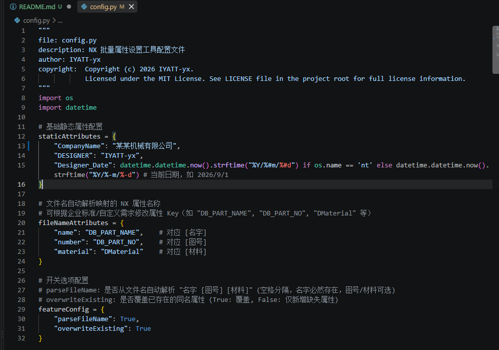
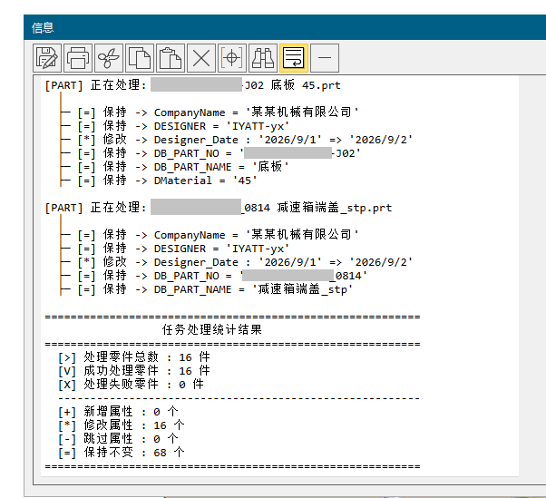

# NX-BatchAttr

2026/9/1  
本工具用于快速批量给模型添加属性，便于图纸标题栏引用。  
适用于没有产品生命周期管理系统（PLM）的中小型企业中，完全手动流程操作的情景下，辅助提升出图效率，减少手动设置标题栏。  
  
  

## 测试环境

* Siemens NX 2506  

## 使用方法

### 图纸模板设置

属性主要就是用于图纸中引用，因此配置图纸模板是必要操作。  
参考：https://blog.iyatt.com/?p=22282  

### 将本工具添加到菜单  

设置方法参考：https://blog.iyatt.com/?p=25270  
本工具的调用入口为：NX-BatchAttr.py  
  

### 运行使用

在 NX 中可以按`Alt`+`F8` 打开`操作记录管理器`，然后选择`NX-BatchAttr.py`运行。  
更推荐按上一节设置图标，方便点击运行。  

执行时会出现对话框，首次使用建议点击`是`  
  

选择一个文本编辑器来打开，比如我这里用 VScode，如果没有可以选记事本，这是系统自带的文本编辑器。  
  

第1处 staticAttributes 是固定属性，给每个模型添加的都一样，比如设置公司名、设计者、设计日期（这里的设计日期取电脑日期），图纸中引用这里的属性名CompanyName、DESIGNER、Designer_Date就可以得到对应的值。属性名可以自定义的，就是一个变量，图纸中对应引用属性名就行。  
第2处 fileNameAttributes 是零件的基本信息属性，约定文件名命名格式为：图号 名称 材料，以空格分隔。或者就一个名字，没有图号和材料。按这里的设定解析出来会把名称设置给 DB_PART_NAME 属性，把图号设置给 DB_PART_NO 属性，把材料名称设置给 DMaterial 属性，即可以自行决定解析出来图号、名称、材料设置给哪个属性名称，名称是自定义的，图纸中引用属性名就可以得到对应的值。  
第3处 featureConfig 是用来控制第2处 fileNameAttributes 是否启用的开关和是否覆盖现有属性的开关。  
设置完成以后保存 config.py 文件。  
  

重新执行工具，这次完成了设置，点击`否`就会直接批量写属性。  
  

## 许可协议

本工具采用 [MIT 许可协议](.\LICENSE) 开源。  